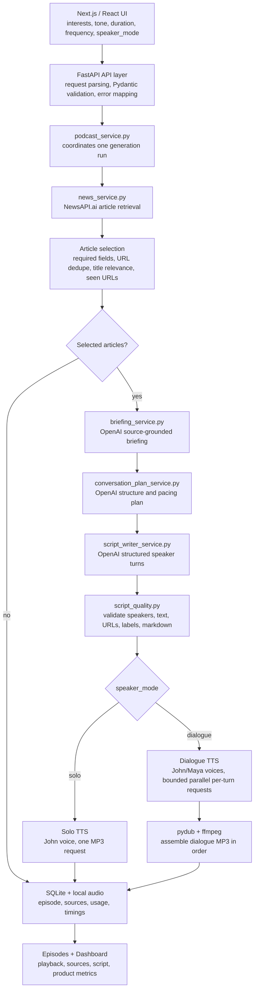

# Neural Notes Solution Design

## Product Summary

Neural Notes is a personal news-to-podcast application. A user chooses interests, tone, duration, frequency, and speaker mode; the app fetches recent articles, generates a source-grounded podcast script, converts the script to MP3 audio, stores the episode locally, and shows both the playable episode and internal product metrics.

The implementation is designed around one complete product loop:

```text
preferences -> recent articles -> selected sources -> script -> MP3 -> saved episode -> playback + metrics
```

The priority is a working, explainable vertical slice. The app uses real providers for news, AI generation, and text-to-speech, while keeping infrastructure intentionally lightweight with SQLite, local audio files, and a manual scheduler endpoint.

---

## What The User Can Do

From the frontend, a user can:

- save interests and select topics for a specific episode
- choose tone: `professional`, `casual`, or `energetic`
- choose duration: `short`, `normal`, or `long`
- choose frequency: `manual`, `daily`, or `weekly`
- choose speaker mode: `solo` or `dialogue`
- generate a podcast from recent news
- listen to the generated MP3
- inspect the script and source articles
- create and run simple local schedules
- view dashboard metrics for reliability, latency, cost, provider usage, and article filtering

The frontend does not generate content itself. It collects user preferences and renders backend results. The backend owns news retrieval, article filtering, OpenAI calls, ElevenLabs calls, persistence, and metrics.

---

## System Flow

The generation path has seven main stages:

```text
1. React form collects episode preferences
2. FastAPI validates the request with Pydantic
3. News service fetches and filters recent articles
4. OpenAI creates briefing -> plan -> structured speaker turns
5. Script quality checks validate the turns before TTS
6. ElevenLabs generates audio
7. SQLite stores episode metadata, articles, timings, cost estimates, and tool usage
```

The important design choice is that each stage has a narrow contract. That makes failures easier to locate. A bad request fails at validation, weak article results fail in the news stage, malformed model output fails before TTS, and audio errors are stored as `audio_failed` instead of being hidden.

---

## Architecture Diagram



---

## Main Components

| Area | Implementation | Responsibility |
| --- | --- | --- |
| Frontend | `frontend/` with Next.js, React, TypeScript, Tailwind | User configuration, episode display, audio playback, schedules, dashboard UI |
| API layer | `backend/app/main.py` | Routes, request/response models, error mapping, CORS, static audio serving |
| Orchestration | `backend/app/services/podcast_service.py` | End-to-end generation flow and status handling |
| News | `backend/app/services/news_service.py` | NewsAPI.ai retrieval, normalization, filtering helpers, relevance checks |
| Briefing | `backend/app/services/briefing_service.py` | Source-grounded OpenAI briefing |
| Planning | `backend/app/services/conversation_plan_service.py` | Episode structure, transitions, pacing, speaker roles |
| Writing | `backend/app/services/script_writer_service.py` | Structured speaker turns for solo/dialogue |
| Quality | `backend/app/services/script_quality.py` | Deterministic validation before TTS |
| Audio | `backend/app/services/tts_service.py` | ElevenLabs MP3 generation and dialogue assembly |
| Storage | `backend/app/repositories/episode_repository.py` | SQLite CRUD for episodes, schedules, and seen URLs |
| Metrics | `backend/app/services/metrics.py` | Dashboard aggregation from SQLite |

---

## Runtime Configuration By Stage

This is the concrete configuration that drives the current implementation.

### User Preference Constraints

| Setting | Current values | Why |
| --- | --- | --- |
| `tone` | `professional`, `casual`, `energetic` | Keeps style selection understandable and bounded |
| `speaker_mode` | `solo`, `dialogue` | Separates simple one-voice audio from two-voice dialogue |
| `frequency` | `manual`, `daily`, `weekly` | Supports manual generation and simple local schedules |
| `short` | 1 minute, max 1 topic | Keeps short episodes focused |
| `normal` | 2 minutes, max 2 topics | Default balance of breadth and length |
| `long` | 3 minutes, max 3 topics | Allows broader coverage without making prompts too large |


### News Retrieval Configuration

| Parameter | Value |
| --- | --- |
| Provider | NewsAPI.ai |
| Endpoint constant | `NEWSAPI_AI_URL` |
| Request action | `getArticles` |
| Language | `eng` |
| Data types | `news`, `blog` |
| Sort | `socialScore` descending |
| Article body length | 1500 characters |
| HTTP timeout | 20 seconds |
| Parallelism | one async request per selected interest |
| 429 handling | one retry after 1.5 seconds |

Candidate counts are duration-based:

| Duration | Candidates fetched per topic | Final articles selected |
| --- | ---: | ---: |
| `short` | 10 | 1 |
| `normal` | 15 | 2 |
| `long` | 25 | 3 |

Freshness windows are schedule-aware:

| Generation mode | Window |
| --- | ---: |
| Manual generation | 2 days |
| Daily scheduled generation | 1 day |
| Weekly scheduled generation | 7 days |

### OpenAI Stage Configuration

All three LLM stages currently use `gpt-4o-mini` and request JSON responses. The difference is the role of each stage, the prompt version, temperature, and token budget.

| Stage | Prompt version | Model | Temperature | Max tokens | Output |
| --- | --- | --- | ---: | ---: | --- |
| Briefing | `signalcast-briefing-v2` | `gpt-4o-mini` | 0.3 | 2000 | `PodcastBriefing` |
| Planning | `signalcast-plan-v5` | `gpt-4o-mini` | 0.5 | 1200 | `ConversationPlan` |
| Writing | `signalcast-writer-v5` | `gpt-4o-mini` | 0.7 | 2500 | `turns: list[ScriptTurn]` |

The temperature increases across the pipeline on purpose:

- **Briefing is low temperature** because it should extract and organize facts, not improvise.
- **Planning is medium temperature** because it needs structure and transitions, but still must stay grounded.
- **Writing is higher temperature** because natural spoken audio needs more variation and fluency.

The writer also uses duration-specific word ranges:

| Duration | Target spoken words |
| --- | ---: |
| `short` | 140-180 |
| `normal` | 300-380 |
| `long` | 540-650 |

### ElevenLabs And Voice Configuration

| Setting | Value |
| --- | --- |
| Provider | ElevenLabs |
| Endpoint shape | `/v1/text-to-speech/{voice_id}` |
| Model | `eleven_multilingual_v2` |
| Output format | `mp3_44100_128` |
| HTTP timeout | 60 seconds |
| Dialogue concurrency | 4 parallel TTS requests maximum |
| Dialogue turn silence | 200 ms between assembled segments |
| Segment fade | 30 ms fade in/out |

Voice IDs are configured through environment variables:

| Env var | Role |
| --- | --- |
| `ELEVENLABS_VOICE_JOHN_CREATIVE` | John; used for solo mode and `host_1` dialogue turns |
| `ELEVENLABS_VOICE_MAYA_EDUCATIONAL` | Maya; used for `host_2` dialogue turns |

Voice settings are role-specific:

| Voice path | Stability | Similarity boost | Style | Speaker boost | Speed |
| --- | ---: | ---: | ---: | --- | ---: |
| John dialogue turns | 0.68 | 0.75 | 0.12 | true | provider default |
| Maya dialogue turns | 0.78 | 0.75 | 0.06 | false | provider default |
| Solo/shared path | 0.75 | 0.75 | 0.10 | false | 0.9 |

John is slightly more expressive because he is the host and owns openings/transitions. Maya is configured a bit more stable because her role is analytical. Solo mode uses a shared setting with slower speed for clearer narration.

---

## Pipeline Contracts

This section documents what each stage receives and returns in the current implementation. It includes the main nested fields because these contracts are what keep the frontend, API, repository layer, and staged LLM pipeline aligned.

### 1. Frontend Generation Request

**Receives from the user:**

| Parameter | Meaning |
| --- | --- |
| Saved interests / selected topics | Browser-side topic preferences. The request sends the selected subset as `selected_interests`. |
| `tone: str` | Writing style: `professional`, `casual`, or `energetic` |
| `duration: str` | Episode size: `short`, `normal`, or `long` |
| `frequency: str` | Whether the run is `manual`, `daily`, or `weekly` |
| `speaker_mode: str` | `solo` for one host, `dialogue` for John/Maya turns |
| `user_id: str` | Local browser user identifier used for schedules, seen URLs, and local events |
| `schedule_id: str or null` | Optional schedule ID when launched from a saved schedule |

**Produces:**

| Field | Meaning |
| --- | --- |
| `selected_interests: list[str]` | Current topic-selection field sent by the frontend |
| `tone: str` | Requested writer tone |
| `duration: str` | Requested duration label |
| `frequency: str` | Requested cadence label |
| `speaker_mode: str` | Requested audio/script format |
| `user_id: str` | Local user identifier |
| `schedule_id: str or null` | Schedule metadata when applicable |
| `generation_type: str` | `manual` from the Generate tab or `scheduled` from scheduler runs |

The frontend remains a product interface. It does not call OpenAI, ElevenLabs, or NewsAPI.ai directly.

### 2. FastAPI Validation

**Receives:**

| Parameter | Meaning |
| --- | --- |
| `topic: str or null` | Legacy single-topic field. If present, it overrides list fields in `resolved_interests`. |
| `interests: list[str]` | Legacy topic list still accepted by the backend |
| `selected_interests: list[str]` | Current frontend topic list |
| `tone: str` | User-facing tone label |
| `duration: str` | Must be `short`, `normal`, or `long` |
| `duration_minutes: int or null` | Optional explicit minute target, clamped to 1-10 minutes |
| `frequency: str` | `manual`, `daily`, or `weekly` |
| `voice_id: str or null` / `voice: str or null` | Legacy voice fields, retained for compatibility |
| `user_id: str` | Local user identifier |
| `speaker_mode: str` | Must be `solo` or `dialogue` |
| `generation_type: str` | `manual` or `scheduled` |
| `schedule_id: str or null` | Optional schedule reference |

**Produces:**

| Field | Meaning |
| --- | --- |
| `GenerateRequest` | Validated Pydantic request object |
| `resolved_interests: list[str]` | Cleaned topic list after resolving `topic`, `selected_interests`, or `interests` |
| `resolved_duration_label: str` | Normalized duration label used downstream |
| `resolved_duration_minutes: int` | Minute target used for writer word budgeting |
| `selected_voice_id: str or null` | Compatibility property resolving `voice_id` or `voice` |

Validation rejects missing interests, unsupported duration, unsupported speaker mode, or too many selected topics for the chosen duration before any provider cost is incurred.

### 3. News Retrieval

**Receives:**

| Parameter | Meaning |
| --- | --- |
| `interests: list[str]` | Topics to query, from `req.resolved_interests` |
| `duration_label: str` | Used to choose candidate count per topic |
| `frequency: str` | Used with `generation_type` to choose the freshness window |
| `generation_type: str` | Manual runs use a 2-day window; scheduled daily/weekly use 1 or 7 days |
| `window_days: int` | Resolved freshness window |
| `articles_count: int` | Candidate count per topic: 10 short, 15 normal, 25 long |
| `NEWS_API_KEY` | NewsAPI.ai provider key |

**Produces:**

| Field | Meaning |
| --- | --- |
| `raw_articles: list[dict]` | Normalized article candidates from NewsAPI.ai |
| `raw_article.title` | Cleaned article title |
| `raw_article.description` | Provider description, summary, or fallback short description |
| `raw_article.content` | Cleaned article body/excerpt capped at 1500 characters |
| `raw_article.source` | Publisher/source name |
| `raw_article.url` | Article URL |
| `raw_article.published_at` | Publication timestamp |
| `raw_article.provider` | `NewsAPI.ai` |
| `raw_article.query` | Interest that triggered the query |
| `raw_article.topic` | Same selected interest used for balancing/filtering |
| `newsapi_calls: int` | Number of selected interests queried |
| `fetched_count: int` | Total candidate articles before filtering |
| `workflow_timings.news_retrieval_ms` | Time spent in the news stage |

The app uses NewsAPI.ai for recent article retrieval. The backend treats this as retrieval only: no article becomes source material until it passes filtering.

### 4. Article Filtering And Selection

**Receives:**

| Parameter | Meaning |
| --- | --- |
| `raw_articles` | Candidate articles from NewsAPI.ai |
| `user_id: str` | Used to fetch seen URLs for this local user |
| `seen_urls: set[str]` | Normalized URLs already used by this local user |
| `interests: list[str]` | Topics used for title relevance and balanced selection |
| `duration_label: str` | Used to resolve final article count |
| `target_article_count: int` | Final number of selected articles: 1 short, 2 normal, 3 long |

**Produces:**

| Field | Meaning |
| --- | --- |
| `complete_articles: list[dict]` | Articles passing required-field checks |
| `complete_count: int` | Count after required-field filtering |
| `invalid_filtered_count: int` | Removed for missing/weak title, description, content, source, URL, or timestamp |
| `deduped: list[dict]` | Articles after normalized URL deduplication |
| `deduped_count: int` | Count after URL deduplication |
| `duplicate_filtered_count: int` | Removed as duplicate URLs |
| `title_relevant: list[dict]` | Articles whose meaningful interest tokens appear in the title |
| `title_relevant_count: int` | Count after title relevance filtering |
| `title_filtered_count: int` | Removed as title-irrelevant |
| `unseen: list[dict]` | Title-relevant articles not previously seen by this local user |
| `unseen_count: int` | Count after seen-URL filtering |
| `seen_filtered_count: int` | Removed because the user already saw the URL |
| `selected: list[dict]` | Final articles passed to the briefing stage |
| `used_count: int` | Number of final articles selected |
| `workflow_timings.article_filtering_ms` | Time spent filtering/selecting |

Filtering bounds LLM context size and prevents weak or repeated sources from driving the episode. The trade-off is that deterministic title matching is transparent but can miss semantically relevant stories.

### 5. OpenAI Briefing

**Receives:**

| Parameter | Meaning |
| --- | --- |
| `articles: list[dict]` | Final selected articles with `title`, `description`, `content`, `source`, `url`, `published_at`, `provider`, `topic`, and `query` |
| `interests: list[str]` | Listener topics used to focus the briefing |
| `OPENAI_API_KEY` | Required OpenAI key |
| `OPENAI_MODEL` | Shared model used for briefing/planning/writing |
| `BRIEFING_PROMPT_VERSION` | Prompt version identifier |

**Produces:**

| Field | Meaning |
| --- | --- |
| `PodcastBriefingResult.briefing` | Validated `PodcastBriefing` object |
| `briefing.episode_theme: str` | One-sentence thread across stories |
| `briefing.listener_interests: list[str]` | Interests copied from the request |
| `briefing.topic_briefings: list[TopicBriefing]` | Per-topic factual briefing objects |
| `topic_briefing.topic: str` | Topic name |
| `topic_briefing.summary: str` | 2-3 sentence factual summary |
| `topic_briefing.why_it_matters: str` | Why the topic matters to the listener |
| `topic_briefing.freshness: str` | How timely/recent the story is |
| `topic_briefing.key_facts: list[BriefingFact]` | Source-backed facts |
| `key_fact.fact: str` | One specific fact |
| `key_fact.source_title: str` | Article title supporting the fact |
| `key_fact.source: str` | Publisher/source name |
| `key_fact.url: str` | Source URL |
| `topic_briefing.tension_or_question: str` | Open question or tension raised by the topic |
| `briefing.do_not_claim: list[str]` | Unsupported claims the writer should avoid |
| `PodcastBriefingResult.openai_usage` | `OpenAIUsage` for this stage |
| `openai_usage.stage` | `openai_briefing` |
| `openai_usage.purpose` | `Briefing LLM` |
| `openai_usage.input_tokens` / `output_tokens` | Token counts or fallback estimates |
| `openai_usage.estimated_cost_usd` | Estimated OpenAI cost |
| `workflow_timings.briefing_llm_ms` | Time spent in the briefing call |

The briefing stage separates factual extraction from writing. This reduces the chance that the writer invents unsupported claims.

### 6. OpenAI Planning

**Receives:**

| Parameter | Meaning |
| --- | --- |
| `briefing: PodcastBriefing` | Source-grounded factual context |
| `speaker_mode: str` | Chooses solo or dialogue planning prompt |
| `tone: str` | Requested writing style |
| `duration_label: str` | Target length category |
| `OPENAI_API_KEY` | Required OpenAI key |
| `OPENAI_MODEL` | Shared model used for this stage |
| `PLAN_PROMPT_VERSION` | Prompt version identifier |

**Produces:**

| Field | Meaning |
| --- | --- |
| `ConversationPlanResult.plan` | Validated `ConversationPlan` object |
| `plan.episode_theme: str` | Planned episode frame |
| `plan.connection_strategy: str` | `single_theme` or `mixed_briefing` |
| `plan.connection_confidence: str` | High/medium/low or free-text confidence |
| `plan.connection_rationale: str` | Why stories connect or should stay separate |
| `plan.opening_intent: str` | How the episode should begin |
| `plan.maya_first_response_intent: str` | Dialogue-only guidance for Maya's first response |
| `plan.beats: list[ConversationBeat or str]` | Ordered body beats |
| `beat.purpose: str` | What the beat accomplishes |
| `beat.john_role: str` | How John guides, reacts, or transitions |
| `beat.maya_role: str` | What Maya analyzes from the briefing |
| `beat.source_basis: list[str]` | Briefing facts or sources supporting the beat |
| `beat.continuity_note: str` | How that beat follows from the previous beat |
| `plan.transition_notes: list[str]` | Concrete transition guidance between beats |
| `plan.closing_intent: str` | Final takeaway/signoff intent |
| `plan.pacing_notes: str` | Optional pacing guidance |
| `ConversationPlanResult.openai_usage` | `OpenAIUsage` for this stage |
| `openai_usage.stage` | `openai_planner` |
| `openai_usage.purpose` | `Conversation Plan LLM` |
| `workflow_timings.conversation_planning_llm_ms` | Time spent in the planning call |

The planner makes narrative decisions before the writer produces final prose. It uses `single_theme` only when there is a specific source-backed shared thread; otherwise it uses `mixed_briefing` and avoids fabricating deeper connections. `connection_rationale` captures the editorial reasoning, `transition_notes` provide concrete transition guidance, and each beat's `continuity_note` handles beat-to-beat continuity. The older `transition_policy` field was removed to avoid redundant planner guidance.

### 7. OpenAI Script Writing

**Receives:**

| Parameter | Meaning |
| --- | --- |
| `briefing: PodcastBriefing` | Facts and constraints from selected articles |
| `plan: ConversationPlan` | Narrative structure to follow |
| `speaker_mode: str` | Required output format: solo or dialogue |
| `tone: str` | Spoken style to apply |
| `duration_label: str` | Word-range category: short, normal, long |
| `duration_minutes: int` | Spoken-time target |
| `target_min` / `target_max` | Resolved spoken word range |
| `WRITER_PROMPT_VERSION` | Prompt version identifier |
| `OPENAI_API_KEY` / `OPENAI_MODEL` | OpenAI configuration |

**Produces:**

| Field | Meaning |
| --- | --- |
| Raw LLM JSON | Must contain only top-level `turns` |
| `turns: list[ScriptTurn]` | Validated structured turn list |
| `turn.speaker: "host_1" or "host_2"` | `host_1` is John; `host_2` is Maya |
| `turn.text: str` | Clean spoken text without labels, markdown, URLs, or preamble |
| `ScriptWriterResult.openai_usage` | `OpenAIUsage` for this stage |
| `openai_usage.stage` | `openai_script_writer` |
| `openai_usage.purpose` | `Script Writer LLM` |
| `workflow_timings.script_writer_llm_ms` | Time spent in the writing call |

The key output is not just prose. It is a structured TTS contract that the backend can validate and map to voices.

### 8. Script Quality Checks

**Receives:**

| Parameter | Meaning |
| --- | --- |
| `turns: list[ScriptTurn]` | Structured speaker turns from the writer |
| `speaker_mode: str` | Validation rules for solo or dialogue |

**Produces:**

| Field | Meaning |
| --- | --- |
| `checked_turns: list[ScriptTurn]` | Validated and normalized turns |
| `checked_turn.speaker` | `host_1` or `host_2`; solo mode allows only `host_1` |
| `checked_turn.text` | Cleaned spoken text |
| `script: str` | Readable transcript rendered from turns |
| Solo `script` format | Paragraph text without speaker labels |
| Dialogue `script` format | `JOHN:` / `MAYA:` blocks generated from speaker IDs |
| `workflow_timings.quality_check_ms` | Time spent validating/rendering |
| Failure | `ScriptGenerationError` with validation details |

This stage prevents bad model output from reaching TTS. It checks speaker IDs, empty text, markdown, raw URLs, and speaker labels inside turn text.

### 9. ElevenLabs TTS

**Receives:**

| Parameter | Meaning |
| --- | --- |
| `script: str or null` | Readable script text, used as fallback input |
| `speaker_mode: str` | Selects solo or dialogue audio generation |
| `turns: list[ScriptTurn] or null` | Structured turns from the script pipeline |
| `ELEVENLABS_API_KEY` | TTS provider key |
| `ELEVENLABS_VOICE_JOHN_CREATIVE` | John voice for solo and host turns |
| `ELEVENLABS_VOICE_MAYA_EDUCATIONAL` | Maya voice for dialogue guest turns |
| `FFMPEG_BINARY` / `FFPROBE_BINARY` | Optional local binary paths for dialogue assembly |

**Produces:**

| Field | Meaning |
| --- | --- |
| `AudioGenerationResult.filename: str` | Generated MP3 filename |
| `AudioGenerationResult.audio_url: str` | Filename returned to the frontend and served by `/audio` |
| `AudioGenerationResult.status: str` | `completed` on success |
| `AudioGenerationResult.error_message: str or null` | Reserved for failure details |
| `AudioGenerationResult.elevenlabs_calls: int` | `1` for solo, number of turn jobs for dialogue |
| `AudioGenerationResult.elevenlabs_characters: int` | Total characters sent to ElevenLabs |
| `AudioGenerationResult.elevenlabs_purpose: str` | `text_to_speech` or `dialogue_text_to_speech` |
| Dialogue render jobs | Per-turn `index`, `role_label`, `text`, `voice_id`, and `voice_settings` |
| Dialogue audio parts | Per-turn MP3 bytes returned by bounded parallel ElevenLabs calls |
| Final dialogue MP3 | Combined with pydub plus 200ms turn silence and fades |
| Failure | `AudioGenerationError` with `calls`, `characters`, and `purpose` populated when possible |

This stage converts validated script into audio and records enough usage data to estimate cost.

### 10. Persistence And Response

**Receives:**

| Parameter | Meaning |
| --- | --- |
| `selected: list[dict]` | Final articles used to create the episode |
| `script: str` | Rendered readable script |
| `audio_url: str or null` | MP3 filename when audio succeeds |
| `status: str` | `completed` or `audio_failed` for generation, `skipped` for scheduled no-fresh-news records |
| `error_message: str or null` | Audio failure or skipped-generation reason |
| `workflow_timings: dict[str, int]` | Per-stage timing map |
| `tool_usage: list[ToolUsageItem]` | News/OpenAI/ElevenLabs usage and cost estimates |
| `req: GenerateRequest` | Original normalized generation preferences |

**Produces:**

| Field | Meaning |
| --- | --- |
| `EpisodeResponse.id` | 12-character local episode ID |
| `EpisodeResponse.title` | Derived from selected article titles |
| `EpisodeResponse.summary` | Derived from selected article descriptions |
| `EpisodeResponse.script` | Readable script shown in the UI |
| `EpisodeResponse.audio_url` | MP3 filename or `null` |
| `EpisodeResponse.interests` | Resolved selected interests |
| `EpisodeResponse.articles` | List of `ArticleSource` objects |
| `ArticleSource.title` / `source` / `url` | Displayed source metadata |
| `ArticleSource.published_at` / `provider` / `topic` | Additional source metadata |
| `EpisodeResponse.tone` / `duration` / `frequency` | Generation preferences |
| `EpisodeResponse.voice` | `John creative` or `John creative + Maya educational` |
| `EpisodeResponse.speaker_mode` | `solo` or `dialogue` |
| `EpisodeResponse.user_id` / `generation_type` / `schedule_id` | Local user and scheduler metadata |
| `EpisodeResponse.article_count` | Final used article count |
| `EpisodeResponse.total_fetched` | Raw article candidates fetched |
| `EpisodeResponse.invalid_articles_filtered` | Required-field rejects |
| `EpisodeResponse.duplicate_articles_filtered` | URL duplicate rejects |
| `EpisodeResponse.title_irrelevant_articles_filtered` | Title relevance rejects |
| `EpisodeResponse.seen_articles_filtered` | Previously seen URL rejects |
| `EpisodeResponse.estimated_cost_usd` | Sum of tool cost estimates |
| `EpisodeResponse.tool_usage` | Tool usage rows for dashboard |
| `EpisodeResponse.workflow_timings` | Stage timing map |
| `EpisodeResponse.created_at` | UTC creation timestamp |
| `EpisodeResponse.generation_time_ms` | Total generation time |
| `EpisodeResponse.success` | `true` only when audio succeeds |
| `EpisodeResponse.status` | `completed`, `audio_failed`, or `skipped` |
| `EpisodeResponse.error_message` | Failure/skipped reason when present |
| `EpisodeResponse.selected_interest_count` | Number of resolved interests |
| `episode_record` | Saved SQLite row in `episodes` |
| `seen_url_records` | Selected URLs marked as seen only after successful audio generation |
| `GenerateResponse` | Returned by direct generation only when `episode.success` is true |
| HTTP errors | Direct route returns `400`, `409`, or `502` for invalid input, no usable articles, or provider/audio failures |

Persistence powers the episode list, dashboard, schedules, seen-article filtering, and local debugging. Audio failures are persisted as `audio_failed` episodes, but the direct generation route still maps them to `502`.

### 11. Frontend Playback And Dashboard

**Receives:**

| Parameter | Meaning |
| --- | --- |
| `GenerateResponse.episode` | Freshly generated successful episode |
| `GET /api/episodes` | Saved episodes including completed, skipped, and audio-failed records |
| `audio_url` | Playable MP3 filename when generation succeeded |
| `NEXT_PUBLIC_API_URL` | Frontend setting used to build backend URLs |
| `GET /api/dashboard/metrics` | Aggregated values from SQLite |
| `POST /api/episodes/{episode_id}/events` | Local engagement events |

**Produces:**

| Field | Meaning |
| --- | --- |
| `episode_card` | Episode metadata/status display |
| `sources` | Source article links and metadata |
| `script_view` | Readable transcript display |
| `audio_player` | Browser audio playback |
| `local_events` | `audio_played`, `audio_completed`, `sources_opened`, or `script_opened` |
| `dashboard view` | Reliability, latency, cost, article-filtering, provider-usage, and engagement metrics |

This completes the product loop: the user can listen, inspect sources, and see whether the system is healthy.

---

## Why Briefer, Planner, And Writer Are Separate

The OpenAI workflow is deliberately split because podcast generation mixes three different jobs that should not be conflated.

### Briefer: facts, evidence, and risks

The briefer reads the selected article content and extracts a structured briefing. It should not write dialogue, polished narration, or speaker labels. Its job is to answer: **What can the episode safely say based on the sources?**

It outputs factual summaries, key source-backed facts, freshness context, why the story matters, and `do_not_claim` constraints. This gives the rest of the pipeline a grounded evidence layer.

### Planner: structure, continuity, and pacing

The planner takes the briefing and decides the episode shape. It should not write final lines. Its job is to answer: **How should the episode flow?**

For solo mode, it plans the hosted intro, story beats, transitions, and signoff. For dialogue mode, it also plans John and Maya's roles: John guides and transitions; Maya carries analysis. The planner decides whether the stories should be connected as one specific source-backed theme or presented as a mixed briefing. `connection_rationale` explains that editorial decision, `transition_notes` give concrete transition guidance, and each beat's `continuity_note` explains how that beat follows from the previous one. The redundant `transition_policy` field was removed so this guidance is not split across overlapping fields.

### Writer: final spoken turns

The writer takes the briefing and plan and produces the final structured `turns`. Its job is to answer: **What exactly should be spoken?**

The writer must follow the facts from the briefer and the structure from the planner. It outputs only JSON turns, not markdown, not raw URLs, and not a free-form transcript. That makes the output usable by TTS without fragile parsing.

### Why this is better than one large prompt

A single prompt would be simpler, but it would make the system harder to debug. If the final script is weak, it is unclear whether the model misunderstood the article, chose a bad structure, or simply wrote poor dialogue.

The staged design creates clearer failure boundaries:

| Problem | Stage that should catch it |
| --- | --- |
| Article facts are weak or unsupported | Briefing |
| Episode jumps around or forces fake connections | Planning |
| Dialogue sounds unnatural or violates speaker rules | Writing / quality checks |
| TTS receives malformed speaker text | Script quality checks |

The trade-off is extra OpenAI calls, higher latency, and more intermediate failure points. I chose this split because the pipeline is easier to inspect, explain, and improve stage by stage.

---

## News Filtering Logic

The news layer fetches more candidates than it uses. This is intentional: selected interests can return noisy or incomplete results, so the backend needs room to filter before choosing final sources.

The filtering path is deterministic:

### 1. Normalize provider output

NewsAPI.ai results are normalized into the fields the rest of the pipeline expects:

| Field | Meaning |
| --- | --- |
| `title` | Clean article title |
| `description` | Provider description, summary, or fallback short description from content |
| `content` | Article body/excerpt capped at 1500 characters |
| `source` | Publisher/source name |
| `url` | Article URL |
| `published_at` | Publication timestamp |
| `provider` | `NewsAPI.ai` |
| `topic` / `query` | Interest that triggered the retrieval |

### 2. Required-field filtering

An article must have enough content to be useful:

| Requirement | Threshold |
| --- | ---: |
| title | at least 12 characters |
| description | at least 40 characters |
| content | at least 300 characters |
| source | required |
| URL | required and valid `http` or `https` URL |
| published timestamp | required and parseable |

This prevents OpenAI from receiving thin or malformed article records.

### 3. URL deduplication

The backend normalizes URLs before comparing them. It lowercases scheme/domain, strips trailing slashes, and removes tracking parameters such as `utm_*`, `fbclid`, `gclid`, `mc_cid`, and `mc_eid`.

The goal is to avoid using the same article twice when the provider returns duplicate URLs with tracking noise.

### 4. Title-token relevance

The selected interest is tokenized and compared against the article title. Stopwords such as `a`, `an`, `and`, `for`, `in`, `of`, `on`, `or`, `the`, `to`, and `with` are ignored. The remaining meaningful interest tokens must appear in the title.

This is intentionally simple and transparent. The downside is that it can reject relevant articles that use synonyms or related entities instead of exact title tokens.

### 5. Seen-article filtering

After a successful generation, selected article URLs are stored for the local user. Future generations filter those URLs out so the same local user does not keep getting repeated stories.

### 6. Balanced final selection

The final selection tries to cover the selected interests before filling remaining slots. This avoids one topic dominating the episode when the user selected multiple interests.

---

## Audio Strategy

Solo and dialogue audio use different strategies because they optimize for different constraints.

### Solo

Solo mode favors simplicity and vocal continuity. The backend renders one script and sends one larger TTS request using John's voice. For short and normal episodes, this avoids unnecessary assembly and usually produces a more continuous narration.

### Dialogue

Dialogue mode favors speaker control and latency. Each structured turn is mapped to John or Maya, rendered with the right ElevenLabs voice, and then assembled in order. Because turns are independent, the backend can use bounded parallel TTS calls.

That design has clear trade-offs:

| Choice | Benefit | Cost |
| --- | --- | --- |
| Per-turn dialogue TTS | Separate voices, lower wall-clock latency, future granular retries | More provider calls, rate-limit exposure, assembly complexity |
| Single solo TTS call | Simpler path, better narration continuity | Less retry granularity, larger all-or-nothing request |

The current implementation uses the more complex path only where it matters: dialogue.

---

## Storage And Metrics

SQLite stores the product state needed by the local app:

- episodes
- selected interests
- source articles
- generation status and errors
- audio filename
- workflow timings
- estimated provider costs
- tool usage
- article filtering counts
- seen article URLs
- schedules

Generated audio is stored as MP3 files under `backend/audio/`. This keeps the app easy to run locally and easy to inspect during development. The trade-off is that local SQLite and disk storage are not suitable for horizontally scaled production workloads.

The dashboard is built from local records. It is product observability, not a full analytics platform. It answers practical questions:

- Are generations succeeding?
- Which stage is slowest?
- How much do episodes roughly cost?
- Are articles being filtered out before OpenAI?
- How much provider usage did each episode require?

---

## Scheduling

Scheduling is represented as local daily or weekly records. The app can save schedules and manually run due schedules through `/api/scheduler/run`.

This proves the product path without introducing a real scheduler, queue, worker fleet, or cron deployment. In production, scheduled generation would move to durable background jobs with idempotency, retries, locks, dead-letter handling, and operational monitoring.

---

## API Surface

| Method | Path | Purpose |
| --- | --- | --- |
| GET | `/health` | Returns backend health and missing provider configuration |
| POST | `/api/podcast/generate` | Generates one podcast episode |
| GET | `/api/episodes` | Lists saved episodes |
| DELETE | `/api/episodes/{episode_id}` | Deletes an episode and local audio file when present |
| POST | `/api/episodes/{episode_id}/events` | Records local UI events such as audio played or sources opened |
| GET | `/api/dashboard/metrics` | Returns dashboard metrics from SQLite |
| POST | `/api/schedules` | Creates a local schedule |
| GET | `/api/schedules` | Lists schedules, optionally by `user_id` |
| PUT | `/api/schedules/{schedule_id}` | Updates a schedule |
| DELETE | `/api/schedules/{schedule_id}` | Deletes a schedule |
| POST | `/api/scheduler/run` | Manually runs due schedules or one forced schedule |

`POST /api/podcast/generate` accepts `selected_interests` or legacy `interests` / `topic`, plus `tone`, `duration`, `frequency`, `speaker_mode`, `user_id`, and optional scheduling metadata. Durations are `short`, `normal`, or `long`; speaker modes are `solo` or `dialogue`.

A successful generation response includes the episode, source articles, readable script, audio URL, status, generation time, estimated cost, tool usage, and workflow timings. Invalid input returns `400`, no fresh usable articles returns `409`, and provider failures return `502`. ElevenLabs/audio failures are saved as `audio_failed` episode records with no audio URL before the direct route returns `502`.

---

## Design Trade-offs

This solution prioritizes a complete, inspectable vertical slice over production-grade infrastructure. The main trade-offs are around generation quality, reliability, latency, cost, and implementation scope.

| Decision | Why I chose it | Trade-off |
| --- | --- | --- |
| Three-step OpenAI pipeline instead of one prompt | I split generation into briefing, planning, and writing so each LLM call has a narrow responsibility. The briefer extracts facts, the planner defines the episode flow, and the writer produces the final spoken turns. | This improves debuggability and output control, but adds latency, cost, and more failure points than a single prompt. |
| Source-grounded briefing before script writing | The writer receives structured facts instead of raw articles, which reduces unsupported claims and makes the final script easier to control. | The briefing step can lose nuance from the original articles, and factuality is still not guaranteed at claim level. |
| Structured script turns instead of free-form script text | The writer outputs speaker turns with explicit speaker IDs, which gives the TTS layer a reliable contract for solo and dialogue modes. | The model must satisfy a stricter JSON schema, so malformed output can fail generation. |
| Deterministic article filtering instead of semantic ranking | I used required-field checks, URL deduplication, title relevance, seen-URL filtering, and duration-based article caps because they are simple and transparent. | This is easy to debug, but it can miss semantically relevant articles if the title does not match the user's interests. |
| Duration-based article caps | Short, normal, and long episodes use different article limits, which keeps prompts, cost, and episode length predictable. | It is a heuristic. Some articles need more context, and some topics may deserve more or fewer sources than the fixed cap allows. |
| Dialogue mode with assembled TTS segments | Dialogue mode makes the output feel more like a real podcast and demonstrates a richer product experience. | It requires multiple TTS calls, audio assembly, speaker validation, and more handling for partial failures. |
| Manual scheduler instead of real recurring jobs | It demonstrates saved podcast configurations and scheduled generation without adding cron or queue infrastructure. | Nothing runs automatically unless the user triggers it. |
| SQLite and local MP3 files | This keeps setup simple and lets the evaluator run the full product locally without provisioning infrastructure. | It is not suitable for multi-user production, horizontal scaling, or durable audio storage. |
| Dashboard from local generation records | The dashboard uses SQLite episode records, workflow timings, tool usage, filtering counts, and local UI events to show product-health signals without external analytics. | Cost and usage are estimates, some legacy/demo fallbacks exist for old records, and this is not a real analytics warehouse or active-user model. |

---

## Implementation Challenges

### Provider configuration

The app depends on NewsAPI.ai, OpenAI, ElevenLabs, voice IDs, and optionally ffmpeg/ffprobe. The backend exposes missing configuration through health checks and clear error states.

### Article quality

Not every user interest returns usable recent articles. The backend avoids generating from weak inputs by filtering incomplete, duplicate, irrelevant, and previously seen articles.

### Structured LLM output

The writer must return valid structured turns. The backend validates the output before TTS so malformed model responses do not become bad audio requests.

### Audio assembly

Dialogue mode is intentionally more complex than solo mode. It needs multiple TTS requests, voice mapping, bounded concurrency, MP3 validation, and ffmpeg-based assembly.

### Cost and latency visibility

The product uses several providers. The dashboard records approximate usage and per-stage timing so cost and bottlenecks are visible instead of hidden.

---

## Development And Validation

Development helpers live in `backend/devtools/`:

- `run_script_fixture_pipeline.py` runs pipeline stages for local debugging.

Backend tests live in `backend/tests/` and cover audio assembly, dialogue behavior, dialogue parsing, pipeline models, and title relevance filtering. Audio tests use fake MP3 segments and skip automatically when local ffmpeg/ffprobe binaries are unavailable.

Useful validation commands:

```bash
python -m compileall backend/app backend/devtools backend/tests
pytest backend/tests
cd frontend && npm run typecheck && npm run build
```

---

## Production Improvements

The main production upgrades would be:

- real authentication and user accounts
- persisted user preferences
- Postgres or another managed relational database
- object storage for MP3 files
- durable background jobs and a real scheduler
- retries, backoff, idempotency, and dead-letter handling
- provider quota handling and billing reconciliation
- structured logs, tracing, metrics, and alerts
- better news ranking with semantic relevance and source quality scoring
- caching for news retrieval and intermediate LLM artifacts
- model routing by stage: use a smaller, cheaper model for deterministic briefing; a stronger reasoning model for planning when episodes become more complex; and a more capable or more creative model for final writing if script quality becomes the bottleneck
- factuality checks before audio generation
- stronger source attribution in scripts
- moderation and content-safety checks
- deployment hardening and managed secrets

The current implementation uses the same OpenAI model across briefing, planning, and writing to keep configuration simple, behavior consistent, and costs predictable. Stage-specific model routing is a natural next step once there is enough usage data to justify optimizing each stage separately.

---

## Final Positioning

Neural Notes is deliberately not a full production podcast platform. It is a complete local product slice that proves the core loop with real providers: configure preferences, retrieve recent sources, generate a grounded script, synthesize audio, persist the episode, play it in the UI, and observe system behavior through a dashboard.

The design favors clarity over infrastructure. Each service has a concrete responsibility, each provider boundary is explicit, and failures remain visible. That makes the system easier to explain, easier to debug, and straightforward to evolve into a more durable production architecture.
